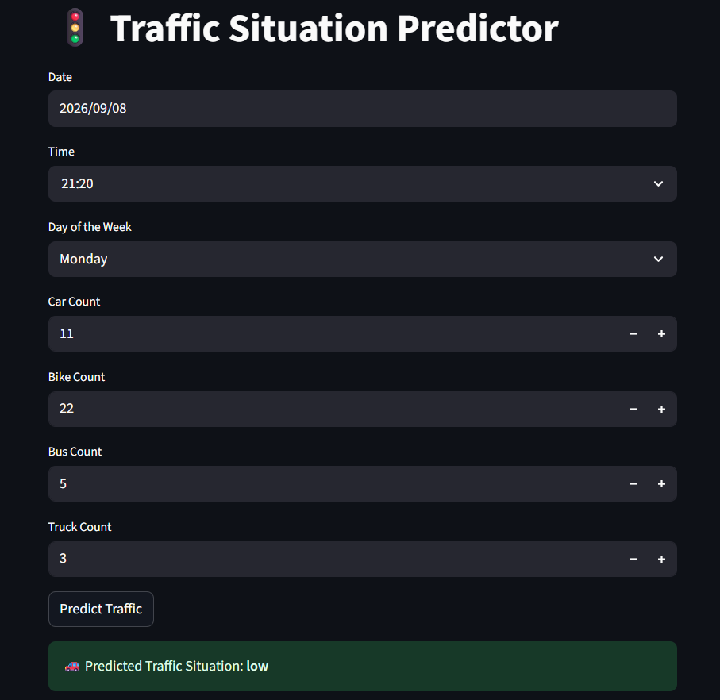

# Traffic Situation Predictor

A machine learning web application that predicts traffic situations using vehicle-count data and day-of-week information with a Random Forest classifier.

## Application Preview



## Overview

This project demonstrates an end-to-end machine learning workflow for traffic situation classification.

The Streamlit application accepts:

- Day of the week
- Car count
- Bike count
- Bus count
- Truck count

The application automatically calculates the total vehicle count, applies the saved `StandardScaler`, and generates a traffic-situation prediction using a trained Random Forest model.

The model predicts one of four traffic situations:

- Heavy
- High
- Low
- Normal

## Features

- Interactive Streamlit web interface
- Random Forest traffic situation classifier
- Day-of-week encoding
- Automatic total vehicle calculation
- StandardScaler preprocessing
- Saved model and scaler artifacts
- Prediction confidence display

## Machine Learning Workflow

1. Load the traffic dataset
2. Prepare traffic-related features
3. Encode the day of the week
4. Calculate total vehicle count
5. Split the data into training and testing sets
6. Standardize the features using `StandardScaler`
7. Train a Random Forest classifier
8. Save the trained model and scaler
9. Use the saved artifacts in the Streamlit application

## Model Features

The final saved model uses six input features:

| Feature | Description |
|---|---|
| Day of the week | Encoded day of the week |
| Car count | Number of cars |
| Bike count | Number of bikes |
| Bus count | Number of buses |
| Truck count | Number of trucks |
| Total | Total vehicle count |

The trained model is a `RandomForestClassifier` and the saved preprocessing object is a `StandardScaler`.

## Tech Stack

- Python
- Pandas
- NumPy
- Scikit-learn
- Streamlit
- Joblib
- Jupyter Notebook

## Project Structure

```text
traffic-predictor/
├── TrafficDataset.csv
├── traffic_prediction_analysis.ipynb
├── app.py
├── random_forest_model.pkl
├── scaler.pkl
├── requirements.txt
└── traffic-prediction-app.png